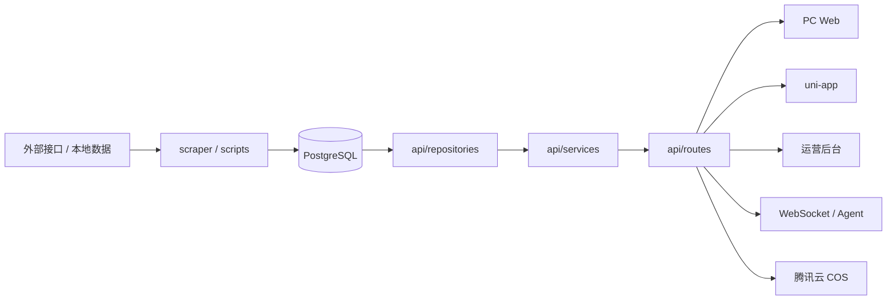

# 洛克百科图鉴

洛克百科图鉴是一个前后端分离的洛克王国资料站与运营平台。项目围绕精灵图鉴、技能、地图、阵容、性格、印记、血脉、共鸣魔法、洛克纪年、相册、反馈和战斗工具等数据，提供 FastAPI 后端、PC Web、uni-app 多端客户端，以及基于 LangChain/LangGraph 的智能问答 Agent。

## 功能概览

- 图鉴查询：精灵列表、精灵详情、属性、技能、技能石、进化链、蛋组、果实、孵蛋匹配、地图点位。
- 战斗工具：阵容推荐、星光对决阵容、同步 PK 分析、异步 AI PK 分析、伤害计算。
- 内容与社区：公告、点赞、关于页、精灵相册、意见反馈、洛克纪年、宠物对话。
- 运营后台：账号、字典、精灵、技能、技能石、Banner、公告、性格、阵容、共鸣魔法、印记、筛选器、孵蛋宠物、洛克纪年、宠物提示词等维护页面。
- 数据链路：脚本从外部接口或本地数据导入 PostgreSQL，后端统一读取数据库并管理腾讯云 COS 图片/文件资源。
- 智能问答：Agent 读取 `skills/` 中的 API 规范，通过工具调用后端接口回答图鉴和 PK 相关问题。

## 项目结构

```text
lkwg_gui/
├─ api/                         # FastAPI 后端
│  ├─ routes/                   # HTTP / WebSocket 路由
│  ├─ services/                 # 业务编排
│  ├─ repositories/             # PostgreSQL 数据访问
│  ├─ schemas/                  # Pydantic 请求/响应模型
│  └─ utils/                    # 属性克制、类型映射、数值工具
├─ db/                          # PostgreSQL 异步连接池
├─ oss/                         # 腾讯云 COS 客户端
├─ common/                      # 通用工具
├─ scraper/                     # 外部数据抓取客户端
├─ scripts/                     # 导入、同步、迁移、建表脚本
├─ sql/                         # PostgreSQL 表结构与初始化 SQL
├─ front/
│  ├─ pc-front/                 # Vue 3 + TypeScript + Vite PC Web
│  └─ mini-app/                 # uni-app H5 / 微信小程序
├─ agents/                      # LangChain/LangGraph 问答 Agent
├─ ws/                          # WebSocket 连接管理和消息处理
├─ skills/                      # Agent Skill 定义
├─ docs/                        # 设计文档、接口说明、样例数据
├─ config.py                    # 环境变量和基础配置
└─ pyproject.toml               # Python 项目配置，使用 uv 管理依赖
```

## 技术栈

后端：

- Python `>=3.13`
- FastAPI
- psycopg / psycopg-pool
- PostgreSQL
- python-dotenv
- 腾讯云 COS SDK
- LangChain / LangGraph / DeepAgents

前端：

- PC Web：Vue 3、TypeScript、Vite、Vue Router、Axios、MapLibre GL
- mini-app：uni-app、Vue 3、Vite，可构建 H5 和微信小程序

## 数据流



采集和同步脚本直接写入 PostgreSQL。FastAPI 通过 repository/service 分层读取和维护数据。前端、运营后台、小程序和 Agent 都通过后端接口访问数据，不直接连接数据库。

## 后端接口

后端入口是 `api/main.py`。应用启动时会创建 PostgreSQL 异步连接池，并初始化运营账号表、微信认证表、AI PK 任务表、精灵筛选器表和公告表等基础结构。

启动后可访问：

- 健康检查：`GET /`
- Swagger：`http://localhost:8000/docs`

主要公共接口：

| 分类 | 端点 | 说明 |
| --- | --- | --- |
| 精灵 | `GET /api/pokemon` | 精灵列表，支持分页、名称、属性、蛋组、异色和排序筛选 |
| 精灵 | `GET /api/pokemon/{pokemon_name}` | 精灵详情 |
| 精灵 | `GET /api/pokemon/evolution-chain/{pokemon_name}` | 进化链 |
| 精灵 | `GET /api/pokemon/body-match` | 按身高体重匹配可孵化精灵 |
| 精灵 | `GET /api/pokemon-eggs` | 精灵蛋查询 |
| 精灵 | `GET /api/pokemon-fruits` | 果实查询 |
| 技能 | `GET /api/skills` | 技能列表 |
| 技能 | `GET /api/skill-types` | 技能类型 |
| 技能 | `GET /api/skill-stones` | 技能石 |
| 字典 | `GET /api/attributes` | 属性列表 |
| 字典 | `GET /api/egg-groups` | 蛋组列表 |
| 字典 | `GET /api/bloodlines` | 血脉 |
| 字典 | `GET /api/resonance-magics` | 共鸣魔法 |
| 字典 | `GET /api/personalities` | 性格 |
| 字典 | `GET /api/pokemon-marks` | 印记和战斗术语 |
| 地图 | `GET /api/pokemon/categories` | 地图分类 |
| 地图 | `GET /api/pokemon/map-points` | 地图点位 |
| 阵容 | `GET /api/pokemon-lineups` | 阵容推荐列表 |
| 阵容 | `GET /api/pokemon-lineups/{lineup_id}` | 阵容详情 |
| 阵容 | `GET /api/starlight-duel/latest` | 最新星光对决阵容 |
| 战斗 | `POST /api/battle-pk` | 同步 PK 分析 |
| 战斗 | `GET /api/battle-pk/random-pokemon-modes` | 随机精灵模式 |
| 战斗 | `POST /api/ai-pk/battle-pk` | 异步 AI PK 分析 |
| 战斗 | `GET /api/ai-pk/tasks/{task_id}` | 查询 AI PK 任务状态 |
| 战斗 | `POST /api/damage/stats` | 伤害计算属性面板 |
| 战斗 | `POST /api/damage/calc` | 伤害计算 |
| 公告 | `GET /api/announcement` | 当前公告 |
| 公告 | `GET /api/announcement/about` | 关于页信息 |
| 公告 | `GET /api/announcement/likes` | 公告点赞数 |
| 公告 | `POST /api/announcement/likes` | 点赞 |
| 相册 | `GET /api/album` | 精灵相册 |
| 相册 | `POST /api/album` | 新增相册照片 |
| 反馈 | `POST /api/feedback` | 提交反馈 |
| 反馈 | `GET /api/feedback` | 查询反馈列表 |
| 纪年 | `GET /api/chronology` | 洛克纪年列表 |
| 纪年 | `GET /api/chronology/{item_id}` | 洛克纪年详情 |
| 对话 | `GET /api/chat/pets/{pet_id}/enabled` | 宠物对话开关 |
| 对话 | `GET /api/chat/pets/{pet_id}/avatar` | 宠物头像 |
| 第三方 | `GET /api/third/merchant` | 远行商人信息 |
| 微信 | `POST /api/wx/login` | 微信小程序静默登录 |
| 文件 | `POST /api/file/upload` | COS 文件上传 |
| WebSocket | `WS /ws` | QQ Agent 消息通道 |
| WebSocket | `WS /ws/{user_id}` | 前端用户推送通道 |
| WebSocket | `WS /ws/pet-chat/{user_id}/{pet_id}` | 宠物对话通道 |

## 运营后台

运营接口统一在 `/api/ops` 下，使用 Bearer Token 认证，角色分为 `admin` 和 `editor`。

主要能力：

- 认证：`/auth/login`、`/auth/me`
- 用户和审计：`/users`、`/audit-logs`
- 基础字典：`/dicts`
- 精灵维护：`/pokemon`、进化链、图片上传、洛克手册技能同步
- 技能维护：`/skills`、技能图标、技能使用查询
- 技能石维护：`/skill-stones`
- 内容维护：`/banners`、`/announcement`、`/feedback`
- 战斗与筛选：`/pokemon-lineups`、`/resonance-magics`、`/pokemon-marks`、`/marks`、`/pokemon-filter-options`
- 孵蛋数据：`/egg-hatch-pets`
- 洛克纪年：`/api/ops/chronology`
- 宠物提示词：`/api/ops/pet-prompt`

## 前端页面

### PC Web

目录：`front/pc-front/`

主要路由：

- `/`：图鉴首页
- `/pokemon/:name`：精灵详情
- `/skills`：技能图鉴
- `/skill-stones`：技能石
- `/body-match`：孵蛋匹配
- `/map`：世界地图
- `/pokemon-marks`：名词解释
- `/lineups`、`/lineups/:id`：阵容推荐
- `/battle-pk`：阵容 PK
- `/ops/login`、`/ops/**`：运营后台

接口地址由环境文件控制：

- `front/pc-front/.env.development`：`VITE_API_BASE_URL=http://localhost:8000`
- `front/pc-front/.env.production`：`VITE_API_BASE_URL=https://wikiroco.com`

### uni-app

目录：`front/mini-app/`

主要页面：

- `pages/index/index`：图鉴首页
- `pages/skill/list`：技能图鉴
- `pages/map/index`：世界地图
- `pages/more/index`：更多入口
- `pages/pokemon/detail`：精灵详情
- `pages/pokemon/album`：精灵相册
- `pages/pokemon/body-match`：孵蛋查询
- `pages/skill/stone`：技能石
- `pages/more/damage-calc`：伤害计算
- `pages/more/pokemon-marks`：名词解释
- `pages/more/pokemon-eggs`：精灵蛋
- `pages/more/pokemon-fruits`：果实
- `pages/more/chronology`、`pages/more/chronology-detail`：洛克纪年
- `pages/more/feedback`：意见反馈
- `pages/lineup/list`、`pages/lineup/detail`：阵容推荐
- `pages/battle-pk/index`：阵容 PK
- `pages/chat/pet`、`pages/chat/pet-edit`：宠物对话

## 环境要求

- Python `>=3.13`
- uv
- PostgreSQL `12+`
- Node.js `^20.19.0 || >=22.12.0`
- npm
- 腾讯云 COS 账号和 Bucket，用于文件上传能力

## 环境变量

根目录创建 `.env`。至少需要 PostgreSQL 配置才能启动后端。

```env
# PostgreSQL
PG_HOST=localhost
PG_PORT=5432
PG_DATABASE=wikiroco
PG_USER=wikiroco
PG_PASSWORD=your_pg_password

# 运营后台
OPS_TOKEN_SECRET=change_me
OPS_TOKEN_TTL_SECONDS=43200
OPS_INIT_USERNAME=admin
OPS_INIT_PASSWORD=admin123456
OPS_INIT_NICKNAME=默认管理员

# 静态资源
STATIC_BASE_URL=https://wikiroco.com
FRIEND_IMAGE_UPLOAD_DIR=/var/www/images/friends
YISE_IMAGE_UPLOAD_DIR=/var/www/images/yise/friends
SKILL_ICON_UPLOAD_DIR=/var/www/images/icon/skill
RESONANCE_MAGIC_ICON_UPLOAD_DIR=/var/www/images/resonance-magic

# 腾讯云 COS
COS_SECRET_ID=your_secret_id
COS_SECRET_KEY=your_secret_key
COS_REGION=ap-guangzhou
COS_BUCKET=your-bucket-name

# 微信小程序
WX_MINI_APPID=your_appid
WX_MINI_SECRET=your_secret

# 远行商人 API
MERCHANT_API_URL=https://wegame.shallow.ink/api/v1/games/rocom/merchant/info
MERCHANT_API_KEY=your_merchant_key
MERCHANT_API_URL_BACKUP=https://ap.xiaopidd.com/api.AppletXCX/getXcxyxshangrenListByCate

# AI / Agent
DASHSCOPE_API_KEY=your_api_key
```

`.env` 不要提交到仓库。生产环境需要配置真实数据库密码、运营后台密钥、默认管理员账号、第三方密钥和文件存储权限。

## 本地启动

### 1. 安装后端依赖

```bash
uv sync
```

### 2. 准备数据库

创建 PostgreSQL 数据库，导入 `sql/wikiroco.sql` 等需要的表结构。根据需要运行 `scripts/` 下的数据脚本补齐基础数据。

常见初始化脚本：

```bash
uv run python scripts/import_personalities.py
uv run python scripts/import_map_points.py
uv run python scripts/sync_xiaoheihe_pets.py
uv run python scripts/import_pokemon_egg.py
uv run python scripts/import_pokemon_fruit.py
uv run python scripts/sync_pokemon_skills_from_pet_jsons.py
uv run python scripts/seed_pokemon_stat_dict.py
uv run python scripts/seed_pet_bloodline_dict.py
uv run python scripts/seed_battle_pk_random_dict.py
```

### 3. 启动后端

```bash
uv run uvicorn api.main:app --reload --port 8000
```

访问：

- `http://localhost:8000/`
- `http://localhost:8000/docs`

### 4. 启动 PC Web

```bash
cd front/pc-front
npm install
npm run dev
```

默认访问 `http://localhost:5173`。

### 5. 启动 uni-app

```bash
cd front/mini-app
npm install
npm run dev:h5
npm run dev:mp-weixin
```

## 常用开发命令

后端：

```bash
uv run uvicorn api.main:app --reload --port 8000
uv run python -m compileall api
uv run python scripts/<script>.py
uv run python agents/main_agent.py
```

PC Web：

```bash
cd front/pc-front
npm run dev
npm run type-check
npm run build
```

mini-app：

```bash
cd front/mini-app
npm run dev:h5
npm run dev:mp-weixin
npm run build:mp-weixin
npm run type-check
```

## 数据库说明

项目使用 PostgreSQL 作为主存储。核心 SQL 文件包括：

- `sql/wikiroco.sql`：主表结构，包含精灵、属性、技能、地图、性格、血脉、进化链、蛋组、阵容、共鸣魔法等。
- `sql/pokemon_mark.sql`：印记、状态、增益、减益、环境等战斗术语。
- `sql/roco_chronology.sql`：洛克纪年。
- `sql/pet_album.sql`：精灵相册。
- `sql/user_feedback.sql`：用户反馈。
- `sql/pet_chat.sql`：宠物对话相关数据。

主要数据域：

- 基础图鉴：`pokemon`、`attribute`、`pokemon_attribute`、`pokemon_trait`、`evolution_chain`
- 技能体系：`skill`、`pokemon_skill`、`skill_stone`
- 孵蛋与筛选：`egg_hatch_pet`、`pokemon_egg`、`pokemon_fruit`、`pokemon_egg_group`、`attribute_matchup`
- 地图与内容：`category`、`pet_map_point`、`banner`、`announcement`、`roco_chronology`
- 战斗与阵容：`pokemon_lineup`、`pokemon_lineup_member`、`pokemon_mark`、`ai_pk_task`
- 运营系统：`ops_users`、`wx_auth`、`pokemon_filter_options`

## Agent

Agent 入口是 `agents/main_agent.py`，名称为“洛克精灵百事通”。它会读取 `skills/` 目录中的 SKILL.md，按接口规范调用 `agents/tools/api_tool.py` 中的 `call_api` 工具。

运行方式：

```bash
uv run python agents/main_agent.py
```

WebSocket 入口：

- `/ws`：QQ Agent 消息通道
- `/ws/{user_id}`：前端用户推送
- `/ws/pet-chat/{user_id}/{pet_id}`：宠物对话

## 自检清单

后端改动后建议运行：

```bash
uv run python -m compileall api
```

PC Web 改动后建议运行：

```bash
cd front/pc-front
npm run type-check
npm run build
```

mini-app 改动后建议运行：

```bash
cd front/mini-app
npm run type-check
npm run build:mp-weixin
```

常用接口检查：

1. `GET /`
2. `GET /api/attributes`
3. `GET /api/pokemon?page=1&page_size=10`
4. `GET /api/skills?name=冲击`
5. `GET /api/skill-stones`
6. `GET /api/pokemon/map-points`
7. `GET /api/chronology`
8. `GET /api/announcement`
9. `GET /api/battle-pk/random-pokemon-modes`
10. `GET /api/pokemon/不存在的精灵`

## 常见问题

### 前端没有数据

- 确认后端已启动在 `8000` 端口。
- 确认 `VITE_API_BASE_URL` 指向正确后端。
- 确认 PostgreSQL 已导入表结构和基础数据。
- 打开浏览器 Network，查看接口是否返回 `401`、`404` 或连接失败。

### API 启动失败

- 检查 PostgreSQL 是否启动。
- 检查 `.env` 中 `PG_HOST`、`PG_DATABASE`、`PG_USER`、`PG_PASSWORD`。
- 确认数据库用户有建表权限，启动时会执行部分 bootstrap。

### 运营后台无法登录

首次启动后端时会初始化运营账号表。默认值来自 `OPS_INIT_*` 环境变量；未配置时用户名是 `admin`，密码是 `admin123456`。生产环境必须改掉默认密码和 `OPS_TOKEN_SECRET`。

### 图片或文件上传失败

检查 `COS_SECRET_ID`、`COS_SECRET_KEY`、`COS_REGION`、`COS_BUCKET`，并确认 Bucket 存在且有写入权限。

### Agent 回答异常

- 确认后端接口可访问。
- 确认 `skills/` 中的接口规范与当前后端一致。
- 确认 `DASHSCOPE_API_KEY` 已配置且可用。
