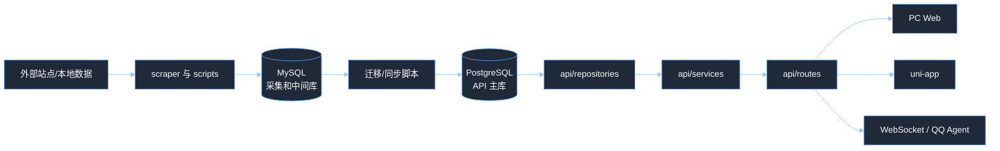

# 洛克王国精灵图鉴

一个前后端分离的洛克王国精灵资料站。项目负责采集和整理精灵、技能、地图、阵容、性格、印记等数据，并通过 FastAPI、PC Web 和 uni-app 小程序/H5 提供查询与运营维护能力。

当前项目主要包含 4 条线：

- 数据采集与迁移：`scraper/`、`main.py`、`scripts/` 从外部站点或本地数据源导入 MySQL，再迁移或同步到 PostgreSQL。
- 后端 API：`api/` 基于 FastAPI，对外提供图鉴、技能、地图、阵容等公共接口，也提供运营后台接口。
- 前端页面：`front/pc-front/` 是 Vue 3 + Vite 的 PC Web；`front/mini-app/` 是 uni-app，可跑 H5 和微信小程序等端。
- 智能问答：`agents/` + `ws/` 通过 WebSocket 接入 QQ 消息，并让 Agent 调用后端 API 回答游戏问题。

## 项目结构

```text
gulu-gui/
├─ api/                         # FastAPI 后端
│  ├─ routes/                   # 路由入口：公共接口、运营接口、WebSocket
│  ├─ services/                 # 业务编排
│  ├─ repositories/             # PostgreSQL 数据访问
│  ├─ schemas/                  # Pydantic 响应/请求模型
│  └─ utils/                    # 转换、媒体地址、属性计算等工具
├─ db/                          # MySQL 写库逻辑 + PostgreSQL 连接池
├─ scraper/                     # 外部站点数据抓取
├─ scripts/                     # 导入、迁移、同步、初始化脚本
├─ sql/                         # PostgreSQL 表结构和补充 SQL
├─ front/
│  ├─ pc-front/                 # Vue 3 + TypeScript + Vite PC Web
│  └─ mini-app/                 # uni-app H5 / 微信小程序等多端
├─ agents/                      # LangChain/LangGraph 问答 Agent
├─ ws/                          # WebSocket 连接与 QQ 消息处理
├─ config.py                    # 环境变量和基础配置
├─ main.py                      # MySQL 侧初始化和部分导入脚本编排
└─ pyproject.toml               # Python 依赖
```

## 整体流程



简单理解：MySQL 更像采集和整理数据时的中间库，FastAPI 正式查询走 PostgreSQL。前端不要直接连数据库，只请求后端接口。

## 后端说明

后端入口是 `api/main.py`，启动时会创建 PostgreSQL 异步连接池，并自动执行运营后台账号表的 bootstrap。

代码分层比较固定：

- `api/routes/`：只负责接 HTTP/WebSocket 请求，做参数声明和错误码。
- `api/services/`：负责业务规则，比如分页、筛选、上传、登录、阵容组装。
- `api/repositories/`：负责 SQL 查询和写入。
- `api/schemas/`：定义接口返回和请求体结构。

主要公共接口：

- `GET /`：健康检查。
- `GET /api/banners`：首页 Banner。
- `GET /api/attributes`：属性列表。
- `GET /api/egg-groups`：蛋组列表。
- `GET /api/pokemon`：精灵列表，支持名称、属性、蛋组、排序、分页。
- `GET /api/pokemon/{pokemon_name}`：精灵详情。
- `GET /api/pokemon/evolution-chain/{pokemon_name}`：进化链。
- `GET /api/pokemon/body-match`：按身高体重匹配可孵化精灵。
- `GET /api/skills`：技能列表。
- `GET /api/skill-types`：技能类型。
- `GET /api/skill-stones`：技能石查询。
- `GET /api/pokemon/categories`：地图分类。
- `GET /api/pokemon/map-points`：地图点位。
- `GET /api/pokemon-marks`：印记/状态/战斗名词解释。
- `GET /api/personalities`：性格字典。
- `GET /api/pokemon-lineups`：阵容推荐列表。
- `GET /api/pokemon-lineups/{lineup_id}`：阵容详情。
- `GET /api/starlight-duel/latest`：最新星光对决阵容。
- `GET /api/starlight-duel/{lineup_id}`：指定星光对决阵容。
- `WebSocket /ws`：QQ Agent 消息通道。

运营后台接口统一在 `/api/ops` 下，需要 Bearer Token：

- 登录与个人信息：`/auth/login`、`/auth/me`
- 字典与用户：`/dicts`、`/users`
- 精灵与进化链：`/pokemon`、`/pokemon/{id}/evolution-chain`
- 技能与技能石：`/skills`、`/skill-stones`
- Banner、性格、阵容、共鸣魔法、印记、徽章：`/banners`、`/personalities`、`/pokemon-lineups`、`/resonance-magics`、`/pokemon-marks`、`/marks`

Swagger 文档启动后访问 `http://localhost:8000/docs`。

## 前端说明

### PC Web

目录是 `front/pc-front/`，技术栈是 Vue 3、TypeScript、Vite、Vue Router、Axios、MapLibre GL。

主要页面：

- `/`：精灵图鉴首页。
- `/pokemon/:name`：精灵详情。
- `/skills`：技能图鉴。
- `/skill-stones`：技能石查询。
- `/body-match`：身高体重孵蛋匹配。
- `/map`：世界地图。
- `/pokemon-marks`：名词解释。
- `/lineups`、`/lineups/:id`：阵容推荐。
- `/ops/login`、`/ops/**`：运营后台。

接口地址通过环境文件配置：

- `front/pc-front/.env.development`：默认 `http://localhost:8000`
- `front/pc-front/.env.production`：默认 `https://wikiroco.com`

### uni-app

目录是 `front/mini-app/`，可用于 H5、微信小程序以及其他 `@dcloudio/uni-mp-*` 目标。

主要页面：

- `pages/index/index`：图鉴。
- `pages/skill/list`：技能图鉴。
- `pages/map/index`：世界地图。
- `pages/more/index`：更多入口。
- `pages/pokemon/detail`：精灵详情。
- `pages/pokemon/body-match`：孵蛋查询。
- `pages/skill/stone`：技能石查询。
- `pages/more/pokemon-marks`：名词解释。
- `pages/lineup/list`、`pages/lineup/detail`：阵容推荐。

## 数据库说明

项目同时使用 MySQL 和 PostgreSQL：

- MySQL：给采集、初始化、部分导入脚本使用，连接来自 `MYSQL_*` 环境变量。
- PostgreSQL：给 FastAPI 查询和运营后台使用，连接来自 `PG_*` 环境变量。

核心 SQL 文件：

- `sql/wikiroco.sql`：PostgreSQL 主表结构，包含精灵、技能、地图、性格、阵容等表。
- `sql/pokemon_mark.sql`：印记、状态、增益、减益、环境等战斗术语表。

主要表：

- 基础图鉴：`pokemon`、`attribute`、`pokemon_attribute`、`pokemon_trait`、`evolution_chain`
- 技能体系：`skill`、`pokemon_skill`、`skill_stone`
- 孵蛋与筛选：`egg_hatch_pet`、`pokemon_egg_group`、`attribute_matchup`
- 地图：`category`、`pet_map_point`
- 内容运营：`banner`、`personality`、`pokemon_lineup`、`pokemon_lineup_member`
- 字典与术语：`sys_dict`、`pokemon_mark`

## 环境要求

后端：

- Python `>= 3.13`
- `uv`
- MySQL `8.x`
- PostgreSQL `12+`

前端：

- Node.js `^20.19.0 || >=22.12.0`
- npm

## 环境变量

根目录创建 `.env`，至少配置数据库连接：

```env
MYSQL_HOST=localhost
MYSQL_PORT=3306
MYSQL_DATABASE=zlkwg_gui
MYSQL_USER=root
MYSQL_PASSWORD=your_mysql_password

PG_HOST=localhost
PG_PORT=5432
PG_DATABASE=wikiroco
PG_USER=wikiroco
PG_PASSWORD=your_pg_password
```

运营后台和静态资源可选配置：

```env
OPS_TOKEN_SECRET=change_me
OPS_TOKEN_TTL_SECONDS=43200
OPS_INIT_USERNAME=admin
OPS_INIT_PASSWORD=admin123456
OPS_INIT_NICKNAME=默认管理员

STATIC_BASE_URL=https://wikiroco.com
FRIEND_IMAGE_UPLOAD_DIR=/var/www/images/friends
YISE_IMAGE_UPLOAD_DIR=/var/www/images/yise/friends
SKILL_ICON_UPLOAD_DIR=/var/www/images/icon/skill
RESONANCE_MAGIC_ICON_UPLOAD_DIR=/var/www/images/resonance-magic
```

注意：`.env` 不要提交到仓库，生产环境必须修改默认管理员密码和 `OPS_TOKEN_SECRET`。

## 启动方式

### 1. 安装后端依赖

在项目根目录执行：

```bash
uv sync
```

### 2. 准备数据库

先准备 MySQL 和 PostgreSQL，并填写 `.env`。

如果需要从 MySQL 迁移到 PostgreSQL，推荐使用当前对齐 `sql/wikiroco.sql` 的脚本：

```bash
uv run python scripts/migrate_mysql_to_pg_wikiroco.py
```

只想预检查迁移逻辑时可以加 `--dry-run`：

```bash
uv run python scripts/migrate_mysql_to_pg_wikiroco.py --dry-run
```

`main.py` 会初始化 MySQL 表，并运行部分导入脚本。代码里完整抓取精灵列表、详情、技能的步骤目前是注释状态，需要全量刷新外部数据时再按需打开。

```bash
uv run python main.py
```

### 3. 启动后端 API

```bash
uv run uvicorn api.main:app --reload --port 8000
```

启动后可访问：

- 接口首页：`http://localhost:8000/`
- Swagger 文档：`http://localhost:8000/docs`

### 4. 启动 PC Web

```bash
cd front/pc-front
npm install
npm run dev
```

默认访问 `http://localhost:5173`。

### 5. 启动 uni-app

```bash
cd front/mini-app
npm install
npm run dev:h5
```

微信小程序开发构建：

```bash
npm run dev:mp-weixin
```

## 常用开发命令

后端：

```bash
uv run uvicorn api.main:app --reload --port 8000
uv run python main.py
uv run python scripts/migrate_mysql_to_pg_wikiroco.py --dry-run
uv run python -m compileall api
uv run python agents/main_agent.py
```

PC Web：

```bash
cd front/pc-front
npm run dev
npm run type-check
npm run build
```

uni-app：

```bash
cd front/mini-app
npm run dev:h5
npm run dev:mp-weixin
npm run build:mp-weixin
npm run type-check
```

## 推荐启动顺序

第一次本地运行建议按这个顺序：

1. 创建 MySQL 和 PostgreSQL 数据库。
2. 填写根目录 `.env`。
3. 执行 `uv sync`。
4. 根据数据来源执行 `uv run python main.py` 或相关 `scripts/` 导入脚本。
5. 执行 `uv run python scripts/migrate_mysql_to_pg_wikiroco.py`，把 MySQL 数据迁移到 PostgreSQL。
6. 执行 `uv run uvicorn api.main:app --reload --port 8000`。
7. 进入 `front/pc-front`，执行 `npm install && npm run dev`。
8. 打开 `http://localhost:5173`。

## 自测用例

下面是 10 条常用检查项，实际返回内容取决于数据库数据：

1. `GET /`：返回 `200`，包含 `message`。
2. `GET /api/attributes`：返回 `200`，结果是属性数组。
3. `GET /api/pokemon?page=1&page_size=10`：返回 `200`，`items` 不超过 10 条。
4. `GET /api/pokemon?name=火&page=1`：返回 `200`，按名称关键词筛选。
5. `GET /api/pokemon?attr=火&attr=水`：返回 `200`，按多属性条件筛选。
6. `GET /api/pokemon/body-match?height_m=1.2&weight_kg=20`：返回 `200`，包含换算后的 cm 和 g。
7. `GET /api/skills?name=冲击`：返回 `200`，按技能名关键词筛选。
8. `GET /api/skill-stones`：返回 `200`，返回技能石列表。
9. `GET /api/pokemon/map-points`：返回 `200`，返回地图点位数组。
10. `GET /api/pokemon/不存在的精灵`：返回 `404`，提示精灵不存在。

## 常见问题

### 前端页面打不开数据

优先检查：

- 后端是否启动在 `8000` 端口。
- PC Web 的 `VITE_API_BASE_URL` 是否指向正确后端。
- PostgreSQL 是否有数据，且 `.env` 中 `PG_*` 配置正确。
- 浏览器 Network 里接口是否返回 `401`、`404` 或连接失败。

### API 启动失败

常见原因：

- PostgreSQL 未启动或账号密码不对。
- `.env` 没有配置 `PG_HOST`、`PG_DATABASE`、`PG_USER`、`PG_PASSWORD`。
- 运营后台 bootstrap 建表失败，需要确认当前 PG 用户有建表权限。

### 列表为空

通常是 PostgreSQL 主库没有数据。先确认 MySQL 侧是否导入成功，再执行：

```bash
uv run python scripts/migrate_mysql_to_pg_wikiroco.py
```

### 运营后台无法登录

首次启动 API 时会自动创建默认管理员。默认值来自环境变量，未配置时是：

- 用户名：`admin`
- 密码：`admin123456`

生产环境必须通过 `.env` 改掉默认值。