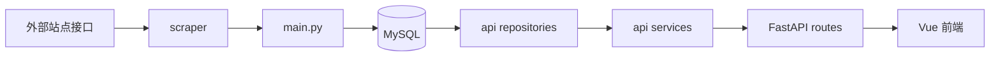

# 洛克王国精灵图鉴

一个前后端分离的小项目，用来抓取洛克王国精灵数据，写入 MySQL，并提供图鉴查询接口和前端展示页面。

项目目前包含 3 条主线：

- 爬虫入库：从目标站点拉取精灵、详情、技能数据并写入数据库
- 后端 API：基于 FastAPI 提供精灵列表、属性筛选、详情查询接口
- 前端页面：基于 Vue 3 展示图鉴首页和精灵详情页

## 项目结构

```text
lkwg_gui/
├─ api/                    # FastAPI 接口层
│  ├─ routes/              # 路由
│  ├─ services/            # 业务编排
│  ├─ repositories/        # 数据库读取
│  ├─ schemas/             # 接口响应模型
│  └─ utils/               # 通用转换逻辑
├─ db/                     # 数据库建表和写库逻辑
├─ scraper/                # 外部站点数据抓取
├─ front/vue-project/      # Vue 3 前端
├─ config.py               # 环境变量和基础配置
├─ main.py                 # 爬取并写库的入口脚本
└─ pyproject.toml          # Python 依赖
```

## 整体流程



## 功能说明

### 1. 数据采集

`main.py` 会依次做下面几件事：

1. 初始化数据库表
2. 拉取精灵列表
3. 拉取精灵详情
4. 拉取技能库
5. 写入 `pokemon`、`pokemon_attribute`、`pokemon_detail`、`skill`、`pokemon_skill`

### 2. 后端接口

当前主要提供这几个接口：

- `GET /`：服务健康检查
- `GET /api/attributes`：查询所有属性，用于前端筛选
- `GET /api/pokemon`：分页查询精灵列表，支持名称搜索和属性筛选
- `GET /api/pokemon/{pokemon_name}`：查询单只精灵详情

### 3. 前端页面

- `/`：图鉴首页
- `/pokemon/:name`：精灵详情页

## 环境要求

### 后端

- Python `>= 3.13`
- 建议使用 `uv`
- MySQL `8.x`

### 前端

- Node.js `^20.19.0 || >=22.12.0`
- npm

## 环境变量

项目通过根目录下的 `.env` 读取数据库配置。

至少需要这些变量：

```env
MYSQL_HOST=localhost
MYSQL_PORT=3306
MYSQL_DATABASE=zlkwg_gui
MYSQL_USER=root
MYSQL_PASSWORD=your_password
```

说明：

- `.env` 已被 `.gitignore` 忽略，不要把真实账号密码提交到仓库
- `BASE_URL` 目前在 `config.py` 中写死为目标站点地址，不需要额外配置

## 启动方式

### 一、安装后端依赖

在项目根目录执行：

```bash
uv sync
```

如果你本地没装 `uv`，也可以自己用 `pip` 安装依赖，但当前项目默认按 `uv` 使用。

### 二、初始化数据

第一次运行建议先执行数据导入脚本：

```bash
uv run python main.py
```

这一步会：

- 自动建表
- 抓取远端数据
- 写入 MySQL

如果数据库已经有数据，重复执行也可以，它会按现有逻辑做更新写入。

### 三、启动后端 API

```bash
uv run uvicorn api.main:app --reload --port 8000
```

启动后可访问：

- 接口首页：`http://localhost:8000/`
- Swagger 文档：`http://localhost:8000/docs`

### 四、启动前端

进入前端目录：

```bash
cd front/vue-project
```

安装依赖：

```bash
npm install
```

启动开发服务器：

```bash
npm run dev
```

默认访问地址通常是：

- `http://localhost:5173`

前端请求地址按环境区分：

- 开发环境：`http://localhost:8000`
- 生产打包：`http://101.126.137.23:8000`

如果你后面要切换接口地址，可以修改前端目录下的环境变量文件：

- `front/vue-project/.env.development`
- `front/vue-project/.env.production`

## 常用开发命令

### 后端

```bash
uv run python main.py
uv run uvicorn api.main:app --reload --port 8000
uv run python -m compileall api
```

### 前端

```bash
npm install
npm run dev
npm run build
```

打包后会自动读取 `front/vue-project/.env.production`，也就是默认请求：

- `http://101.126.137.23:8000`

## 数据表概览

当前主要数据表：

- `pokemon`：精灵基础信息
- `pokemon_attribute`：精灵属性
- `pokemon_detail`：种族值、特性、克制关系
- `skill`：技能库
- `pokemon_skill`：精灵与技能关联

## 启动顺序建议

如果你是第一次跑项目，推荐顺序如下：

1. 准备 MySQL，并填写 `.env`
2. 执行 `uv sync`
3. 执行 `uv run python main.py`
4. 执行 `uv run uvicorn api.main:app --reload --port 8000`
5. 进入 `front/vue-project`
6. 执行 `npm install`
7. 执行 `npm run dev`
8. 打开 `http://localhost:5173`

## 常见问题

### 1. 前端页面打不开数据

先检查这 3 件事：

- 后端是否已经启动在 `8000` 端口
- 前端是否运行在 `5173` 端口
- 数据库里是否已经导入数据

### 2. 执行 `main.py` 失败

优先检查：

- MySQL 连接配置是否正确
- 数据库是否允许当前账号连接
- 网络是否能访问外部目标站点

### 3. 接口有响应但列表为空

通常是数据库还没导入数据，可以先执行：

```bash
uv run python main.py
```