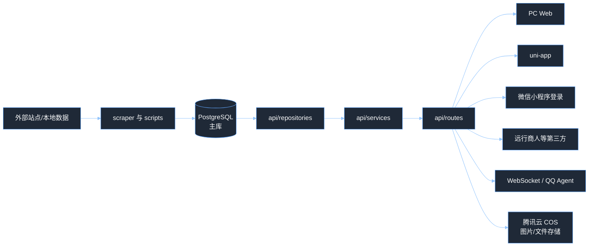

# 洛克王国精灵图鉴

一个前后端分离的洛克王国精灵资料站。项目负责采集和整理精灵、技能、地图、阵容、性格、印记、血脉、共鸣魔法等数据，并通过 FastAPI、PC Web 和 uni-app 小程序/H5 提供查询与运营维护能力，同时内置 LangChain/LangGraph 智能问答 Agent。

当前项目主要包含 5 条线：

- 数据采集与同步：`scraper/`、`scripts/` 从外部站点或本地数据源直接导入并同步到 PostgreSQL。
- 后端 API：`api/` 基于 FastAPI，对外提供图鉴、技能、地图、阵容、PK 对战分析等公共接口，也提供完整的运营后台 CRUD。
- 文件存储：`oss/` 基于腾讯云 COS，统一管理精灵图片、技能图标、异色立绘等静态资源。
- 前端页面：`front/pc-front/` 是 Vue 3 + Vite 的 PC Web；`front/mini-app/` 是 uni-app，可跑 H5 和微信小程序等端。
- 智能问答：`agents/` + `ws/` 通过 WebSocket 接入 QQ 消息，Agent 可调用后端 API 回答游戏问题，支持 CLI 和子 Agent（PK 分析）。

## 项目结构

```text
lkwg_gui/
├─ api/                         # FastAPI 后端
│  ├─ routes/                   # 路由入口：公共接口、运营接口、微信登录、第三方、AI PK、文件上传、WebSocket
│  ├─ services/                 # 业务编排：精灵、技能、阵容、PK 分析、Banner、性格、微信登录
│  ├─ repositories/             # PostgreSQL 数据访问层
│  ├─ schemas/                  # Pydantic 响应/请求模型
│  └─ utils/                    # 属性克制计算、类型映射等工具
├─ db/                          # PostgreSQL 异步连接池（psycopg v3）
├─ oss/                         # 腾讯云 COS 对象存储客户端
├─ common/                      # 共享工具
│  └─ utils/                    # LLM 工具、JSON 解析、文件写入、哈希等
├─ scraper/                     # 外部站点数据抓取（API 客户端）
├─ scripts/                     # 导入、同步、迁移、建表脚本（独立运行，直接写 PG）
├─ sql/                         # PostgreSQL 表结构（主表 + 印记术语表）
├─ front/
│  ├─ pc-front/                 # Vue 3 + TypeScript + Vite PC Web
│  └─ mini-app/                 # uni-app H5 / 微信小程序等多端
├─ agents/                      # LangChain/LangGraph 问答 Agent + PK 子 Agent
│  ├─ tools/                    # Agent 工具（call_api）
│  └─ sub/                      # 子 Agent（PK 分析）
├─ ws/                          # WebSocket 连接管理 + QQ 消息处理
│  └─ handlers/                 # QQ Agent 消息路由
├─ skills/                      # Agent Skill 定义（精灵图鉴 API 规范）
│  ├─ pokemon-guide/            # 洛克王国精灵图鉴 Skill
│  └─ find-skills/              # 技能查询 Skill
├─ docs/                        # 文档、样例数据、设计文档
├─ logs/                        # 运行日志
├─ config.py                    # 环境变量和基础配置
└─ pyproject.toml               # Python 依赖（uv 管理）
```

## 整体流程



简单理解：采集脚本直接写入 PostgreSQL，FastAPI 查询同一个 PG 库。图片等静态资源统一上传到腾讯云 COS。前端不要直接连数据库，只请求后端接口。

## 后端说明

后端入口是 `api/main.py`，启动时创建 PostgreSQL 异步连接池，并自动执行以下 bootstrap：

- 运营后台账号表初始化（默认管理员）
- 微信小程序认证表初始化
- AI PK 任务表初始化
- 精灵筛选器选项表初始化

代码分层比较固定：

- `api/routes/`：只负责接 HTTP/WebSocket 请求，做参数声明和错误码。共 7 个路由器：
  - `pokemon.py`（`/api`）—— 公共图鉴接口
  - `ops.py`（`/api/ops`）—— 运营后台 CRUD（需 Bearer Token）
  - `wx.py`（`/api/wx`）—— 微信小程序静默登录
  - `ai_pk.py`（`/api/ai-pk`）—— AI PK 异步任务
  - `third.py`（`/api/third`）—— 第三方集成（远行商人）
  - `file_upload.py`（`/api/file`）—— COS 通用文件上传
  - `ws_route.py` —— WebSocket（QQ Agent + 前端推送）
- `api/services/`：负责业务规则，比如分页、筛选、上传、登录、阵容组装、PK 分析编排。
- `api/repositories/`：负责 SQL 查询和写入。
- `api/schemas/`：定义接口返回和请求体结构。

### 主要公共接口

| 类别 | 端点 | 说明 |
|------|------|------|
| 根 | `GET /` | 健康检查 |
| Banner | `GET /api/banners` | 首页/活动 Banner 轮播图 |
| 精灵 | `GET /api/pokemon` | 精灵列表，支持名称/属性/蛋组/异色/排序/分页/预设筛选 |
| 精灵 | `GET /api/pokemon/{name}` | 精灵详情（含种族值、特性、克制、技能、防御倍率） |
| 精灵 | `GET /api/pokemon/evolution-chain/{name}` | 进化链 |
| 精灵 | `GET /api/pokemon/body-match` | 按身高体重匹配可孵化精灵 |
| 精灵 | `GET /api/pokemon-eggs` | 精灵蛋查询（分页） |
| 精灵 | `GET /api/pokemon-fruits` | 精灵果实查询（分页） |
| 技能 | `GET /api/skills` | 技能列表（名称/类型/属性筛选） |
| 技能 | `GET /api/skill-types` | 技能类型列表 |
| 技能 | `GET /api/skill-stones` | 技能石查询 |
| 属性 | `GET /api/attributes` | 属性列表 |
| 属性 | `GET /api/egg-groups` | 蛋组列表 |
| 地图 | `GET /api/pokemon/categories` | 地图分类 |
| 地图 | `GET /api/pokemon/map-points` | 地图点位 |
| 阵容 | `GET /api/pokemon-lineups` | 阵容推荐列表（支持分类/ID 筛选） |
| 阵容 | `GET /api/pokemon-lineups/{id}` | 阵容详情 |
| 阵容 | `GET /api/starlight-duel/latest` | 最新星光对决阵容 |
| 阵容 | `GET /api/starlight-duel/{id}` | 指定星光对决阵容 |
| 战斗 | `GET /api/battle-pk/random-pokemon-modes` | 随机精灵模式选项 |
| 战斗 | `POST /api/battle-pk` | PVP 对战分析（同步，返回结构化分析结果） |
| 战斗 | `POST /api/ai-pk/battle-pk` | PVP 对战分析（异步，通过 WebSocket 推送结果） |
| 战斗 | `GET /api/ai-pk/tasks/{task_id}` | 查询异步 PK 任务状态和结果 |
| 词典 | `GET /api/bloodlines` | 血脉字典 |
| 词典 | `GET /api/resonance-magics` | 共鸣魔法列表 |
| 词典 | `GET /api/personalities` | 性格字典（含种族值修正） |
| 词典 | `GET /api/pokemon-marks` | 印记/状态/战斗名词解释 |
| 词典 | `GET /api/pokemon-filter-options` | 精灵筛选选项（异色/排序预设） |
| 第三方 | `GET /api/third/merchant` | 远行商人信息 |
| 微信 | `POST /api/wx/login` | 微信小程序静默登录 |
| 文件 | `POST /api/file/upload` | COS 通用文件上传 |
| WebSocket | `WS /ws` | QQ Agent 消息通道 |
| WebSocket | `WS /ws/{user_id}` | 前端用户推送通道（PK 结果流式推送） |

### 运营后台接口

统一在 `/api/ops` 下，需要 Bearer Token 认证（角色分为 `admin` 和 `editor`）：

- 认证：`POST /auth/login`、`GET /auth/me`、`PUT /auth/me`
- 字典：`GET|POST /dicts`、`PUT|DELETE /dicts/{id}`
- 用户：`GET|POST /users`、`PUT|DELETE /users/{id}`
- 精灵：`GET|POST /pokemon`、`GET|PUT|DELETE /pokemon/{id}`，含进化链管理、图片上传（异色/朋友图）
- 技能：`GET|POST /skills`、`GET|PUT|DELETE /skills/{id}`，含图标上传、使用查询
- 技能石：`GET|POST /skill-stones`、`GET|PUT|DELETE /skill-stones/{id}`，含可用技能搜索
- Banner：`GET|POST /banners`、`PUT|DELETE /banners/{id}`
- 性格：`GET|POST /personalities`、`GET|PUT|DELETE /personalities/{id}`，含重置
- 阵容：`GET|POST /pokemon-lineups`、`GET|PUT|DELETE /pokemon-lineups/{id}`，含精灵/技能搜索辅助
- 共鸣魔法：`GET|POST /resonance-magics`、`GET|PUT|DELETE /resonance-magics/{id}`，含图标上传
- 精灵印记：`GET|POST /pokemon-marks`、`PUT|DELETE /pokemon-marks/{id}`
- 精灵筛选器：`GET|POST /pokemon-filter-options`、`PUT|DELETE /pokemon-filter-options/{id}`

Swagger 文档启动后访问 `http://localhost:8000/docs`。

## 前端说明

### PC Web

目录是 `front/pc-front/`，技术栈是 Vue 3、TypeScript、Vite、Vue Router、Axios、MapLibre GL。

主要页面：

- `/`：精灵图鉴首页（含筛选和排序）
- `/pokemon/:name`：精灵详情
- `/skills`：技能图鉴
- `/skill-stones`：技能石查询
- `/body-match`：身高体重孵蛋匹配
- `/map`：世界地图
- `/pokemon-marks`：名词解释
- `/lineups`、`/lineups/:id`：阵容推荐
- `/battle-pk`：阵容 PK 对战分析
- `/ops/login`、`/ops/**`：运营后台（14 个子页面）

接口地址通过环境文件配置：

- `front/pc-front/.env.development`：默认 `http://localhost:8000`
- `front/pc-front/.env.production`：默认 `https://wikiroco.com`

### uni-app

目录是 `front/mini-app/`，可用于 H5、微信小程序以及其他 `@dcloudio/uni-mp-*` 目标。

主要页面：

- `pages/index/index`：精灵图鉴
- `pages/skill/list`：技能图鉴
- `pages/map/index`：世界地图
- `pages/more/index`：更多入口
- `pages/pokemon/detail`：精灵详情
- `pages/pokemon/body-match`：孵蛋查询
- `pages/skill/stone`：技能石查询
- `pages/more/pokemon-marks`：名词解释
- `pages/more/pokemon-eggs`：精灵蛋查询
- `pages/more/pokemon-fruits`：精灵果实查询
- `pages/lineup/list`、`pages/lineup/detail`：阵容推荐
- `pages/battle-pk/index`：阵容 PK

## 数据库说明

项目使用 PostgreSQL 作为唯一存储：采集脚本、FastAPI 查询和运营后台都连同一个库，连接信息来自 `PG_*` 环境变量。

核心 SQL 文件：

- `sql/wikiroco.sql`：PostgreSQL 主表结构，包含精灵、属性、技能、地图、性格、血脉、进化链、蛋组、阵容、共鸣魔法等表。
- `sql/pokemon_mark.sql`：印记、状态、增益、减益、环境等战斗术语表。

主要表：

- 基础图鉴：`pokemon`、`attribute`、`pokemon_attribute`、`pokemon_trait`、`evolution_chain`
- 技能体系：`skill`、`pokemon_skill`、`skill_stone`
- 孵蛋与筛选：`egg_hatch_pet`、`pokemon_egg`、`pokemon_fruit`、`pokemon_egg_group`、`attribute_matchup`
- 地图：`category`、`pet_map_point`
- 内容运营：`banner`、`personality`、`pokemon_lineup`、`pokemon_lineup_member`
- 战斗与词典：`sys_dict`（血脉、共鸣魔法、随机精灵模式等）、`pokemon_mark`、`ai_pk_task`
- 运营系统：`ops_users`、`wx_auth`、`pokemon_filter_options`

## 环境要求

后端：

- Python `>= 3.13`
- `uv`
- PostgreSQL `12+`
- 腾讯云 COS（用于图片/文件存储）

前端：

- Node.js `^20.19.0 || >=22.12.0`
- npm

## 环境变量

根目录创建 `.env`，至少配置数据库连接：

```env
# PostgreSQL 数据库
PG_HOST=localhost
PG_PORT=5432
PG_DATABASE=wikiroco
PG_USER=wikiroco
PG_PASSWORD=your_pg_password

# 运营后台
OPS_TOKEN_SECRET=change_me
OPS_TOKEN_TTL_SECONDS=43200
OPS_INIT_USERNAME=admin
OPS_INIT_PASSWORD=admin123456
OPS_INIT_NICKNAME=默认管理员

# 静态资源（默认使用 https://wikiroco.com）
STATIC_BASE_URL=https://wikiroco.com
FRIEND_IMAGE_UPLOAD_DIR=/var/www/images/friends
YISE_IMAGE_UPLOAD_DIR=/var/www/images/yise/friends
SKILL_ICON_UPLOAD_DIR=/var/www/images/icon/skill
RESONANCE_MAGIC_ICON_UPLOAD_DIR=/var/www/images/resonance-magic

# 腾讯云 COS（图片/文件上传）
COS_SECRET_ID=your_secret_id
COS_SECRET_KEY=your_secret_key
COS_REGION=ap-guangzhou
COS_BUCKET=your-bucket-name

# 微信小程序
WX_MINI_APPID=your_appid
WX_MINI_SECRET=your_secret

# AI / Agent（DashScope API）
DASHSCOPE_API_KEY=your_api_key

# 远行商人 API
MERCHANT_API_URL=https://wegame.shallow.ink/api/v1/games/rocom/merchant/info
MERCHANT_API_KEY=your_merchant_key
```

注意：`.env` 不要提交到仓库，生产环境必须修改默认管理员密码、`OPS_TOKEN_SECRET` 以及所有第三方 API 密钥。

## 启动方式

### 1. 安装后端依赖

在项目根目录执行：

```bash
uv sync
```

### 2. 准备数据库

先准备 PostgreSQL，并填写 `.env`。表结构参考 `sql/wikiroco.sql`，可在新建库后导入。需要补充数据时按需运行 `scripts/` 下的 `import_*` / `sync_*` / `seed_*` 脚本，每个脚本都是独立可执行的。

常用数据初始化顺序：

```bash
uv run python scripts/import_personalities.py    # 性格数据
uv run python scripts/import_map_points.py       # 地图点位
uv run python scripts/sync_xiaoheihe_pets.py     # 精灵数据（主要数据源，文件最大）
uv run python scripts/import_pokemon_egg.py      # 精灵蛋
uv run python scripts/import_pokemon_fruit.py    # 精灵果实
uv run python scripts/sync_pokemon_skills_from_pet_jsons.py  # 技能同步
```

### 3. 启动后端 API

```bash
uv run uvicorn api.main:app --reload --port 8000
```

启动后可访问：

- 接口首页：`http://localhost:8000/`
- Swagger 文档：`http://localhost:8000/docs`

### 4. 启动 PC Web

```bash
cd front/pc-front
npm install
npm run dev
```

默认访问 `http://localhost:5173`。

### 5. 启动 uni-app

```bash
cd front/mini-app
npm install
npm run dev:h5            # H5 开发
npm run dev:mp-weixin     # 微信小程序开发
```

## 常用开发命令

后端：

```bash
uv run uvicorn api.main:app --reload --port 8000    # API 开发服务器
uv run python scripts/<script>.py                    # 运行数据脚本
uv run python -m compileall api                      # 语法检查
uv run python agents/main_agent.py                   # Agent CLI 交互模式
```

PC Web：

```bash
cd front/pc-front
npm run dev              # 开发服务器
npm run type-check       # TypeScript 类型检查
npm run build            # 生产构建
```

uni-app：

```bash
cd front/mini-app
npm run dev:h5           # H5 开发
npm run dev:mp-weixin    # 微信小程序开发
npm run build:mp-weixin  # 微信小程序生产构建
npm run type-check       # TypeScript 类型检查
```

## 智能问答 Agent

Agent 入口在 `agents/main_agent.py`，基于 LangChain/LangGraph 构建。Agent 名称为"洛克精灵百事通"，通过读取 `skills/` 目录下的 SKILL.md 获取可用 API 规范，然后使用 `call_api` 工具调用后端接口回答用户问题。

核心组件：

- `agents/main_agent.py`：主 Agent，负责意图理解和 API 调用编排
- `agents/tools/api_tool.py`：`call_api` 工具，封装 HTTP 请求调用后端
- `agents/sub/pk_subagent.py`：PK 子 Agent，负责 PVP 对战分析（支持同步/异步/流式）

支持两种运行模式：

1. **CLI 交互**：`uv run python agents/main_agent.py`
2. **WebSocket 接入**：通过 `/ws` 接收 QQ 消息并异步回复

Agent 使用的 Skill 定义在 `skills/` 目录下，包含完整的 API 接口规范和调用示例。

## 自测用例

下面是 10 条常用检查项，实际返回内容取决于数据库数据：

1. `GET /`：返回 `200`，包含 `message`。
2. `GET /api/attributes`：返回 `200`，结果是属性数组。
3. `GET /api/pokemon?page=1&page_size=10`：返回 `200`，`items` 不超过 10 条。
4. `GET /api/pokemon?name=火&page=1`：返回 `200`，按名称关键词筛选。
5. `GET /api/pokemon?attr=火&attr=水`：返回 `200`，按多属性条件筛选。
6. `GET /api/pokemon/body-match?height_m=1.2&weight_kg=20`：返回 `200`，包含换算后的 cm 和 g。
7. `GET /api/skills?name=冲击`：返回 `200`，按技能名关键词筛选。
8. `GET /api/skill-stones`：返回 `200`，返回技能石列表。
9. `GET /api/pokemon/map-points`：返回 `200`，返回地图点位数组。
10. `GET /api/pokemon/不存在的精灵`：返回 `404`，提示精灵不存在。

## 常见问题

### 前端页面打不开数据

优先检查：

- 后端是否启动在 `8000` 端口。
- PC Web 的 `VITE_API_BASE_URL` 是否指向正确后端。
- PostgreSQL 是否有数据，且 `.env` 中 `PG_*` 配置正确。
- 浏览器 Network 里接口是否返回 `401`、`404` 或连接失败。

### API 启动失败

常见原因：

- PostgreSQL 未启动或账号密码不对。
- `.env` 没有配置 `PG_HOST`、`PG_DATABASE`、`PG_USER`、`PG_PASSWORD`。
- 运营后台 bootstrap 建表失败，需要确认当前 PG 用户有建表权限。

### 列表为空

通常是 PostgreSQL 主库没有数据。按 `sql/wikiroco.sql` 建好表后，运行 `scripts/` 下相关的 `import_*` / `sync_*` / `seed_*` 脚本补齐数据。

### 运营后台无法登录

首次启动 API 时会自动创建默认管理员。默认值来自环境变量，未配置时是：

- 用户名：`admin`
- 密码：`admin123456`

生产环境必须通过 `.env` 改掉默认值。

### 图片上传失败

检查 COS 相关环境变量是否正确配置（`COS_SECRET_ID`、`COS_SECRET_KEY`、`COS_REGION`、`COS_BUCKET`），确认 COS Bucket 已创建且有写入权限。

### Agent 无法回答或回答不准确

- 确认 Agent 使用的 `POKEMON_API_BASE_URL` 指向正确的后端地址。
- 确认 `skills/` 目录下的 SKILL.md 与当前 API 实际接口一致。
- 确认 `DASHSCOPE_API_KEY` 已配置且有效。
