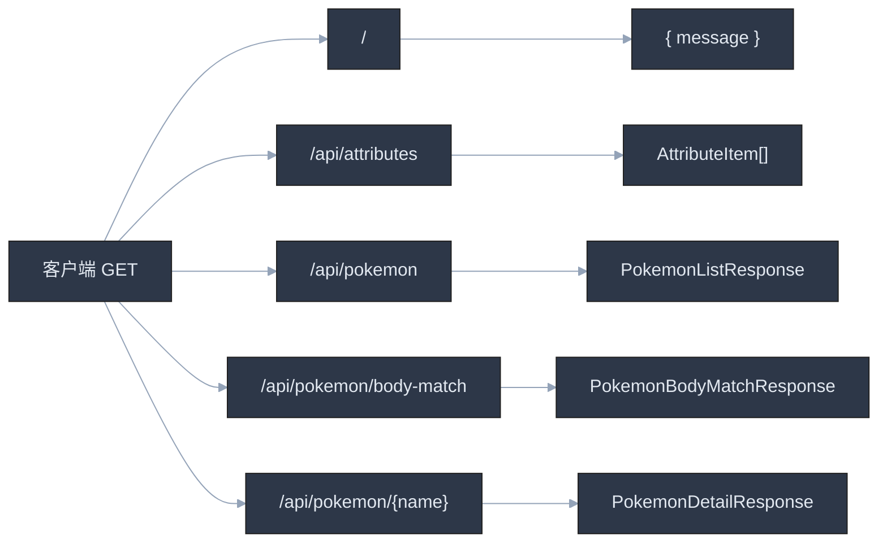

# 洛克王国精灵图鉴 API 文档

- **服务框架**: FastAPI  
- **版本**: `1.0.0`（见 `api/main.py`）  
- **说明**: 仅支持 **GET**；已开启 CORS（`allow_origins=["*"]`）。

---

## 通用说明

| 项目 | 说明 |
|------|------|
| 成功响应 | HTTP `200`，JSON 正文为下表各接口「响应体」结构 |
| 详情不存在 | `GET /api/pokemon/{pokemon_name}` 返回 HTTP `404`，`{"detail":"精灵不存在"}` |

---

## 1. 根路径

| 项目 | 内容 |
|------|------|
| **方法 / 路径** | `GET /` |
| **入参** | 无 |
| **出参** | JSON 对象 |

**响应体字段**

| 字段 | 类型 | 说明 |
|------|------|------|
| `message` | `string` | 固定提示文案，例如运行状态说明 |

---

## 2. 属性列表（筛选用）

| 项目 | 内容 |
|------|------|
| **方法 / 路径** | `GET /api/attributes` |
| **入参** | 无 |
| **出参** | JSON 数组，元素类型见下表 |

**响应体**：`AttributeItem[]`

| 字段 | 类型 | 说明 |
|------|------|------|
| `attr_name` | `string` | 属性名称 |
| `attr_image` | `string` | 属性图标地址 |

---

## 3. 精灵列表（分页 + 筛选）

| 项目 | 内容 |
|------|------|
| **方法 / 路径** | `GET /api/pokemon` |

**查询参数（Query）**

| 参数 | 类型 | 必填 | 默认 | 约束 / 说明 |
|------|------|------|------|-------------|
| `name` | `string` | 否 | `""` | 精灵名称 **关键词**（模糊） |
| `attr` | `string` | 否 | `""` | 属性名称 **精确** 筛选 |
| `page` | `integer` | 否 | `1` | ≥ 1 |
| `page_size` | `integer` | 否 | `30` | 1～100 |

**响应体**：`PokemonListResponse`

| 字段 | 类型 | 说明 |
|------|------|------|
| `total` | `integer` | 符合条件的总条数 |
| `page` | `integer` | 当前页码 |
| `page_size` | `integer` | 每页条数 |
| `items` | `PokemonListItem[]` | 当前页数据 |

**`PokemonListItem`**

| 字段 | 类型 | 说明 |
|------|------|------|
| `no` | `string` | 编号 |
| `name` | `string` | 名称 |
| `image_url` | `string` | 立绘/头像 URL |
| `type` | `string` | 类型编码等 |
| `type_name` | `string` | 类型展示名 |
| `form` | `string` | 形态编码等 |
| `form_name` | `string` | 形态展示名 |
| `attributes` | `AttributeItem[]` | 属性列表 |

---

## 4. 按身高体重匹配精灵

| 项目 | 内容 |
|------|------|
| **方法 / 路径** | `GET /api/pokemon/body-match` |

**查询参数（Query）**

| 参数 | 类型 | 必填 | 约束 | 说明 |
|------|------|------|------|------|
| `height_m` | `number` | 是 | &gt; 0 | 身高，单位 **米 (m)** |
| `weight_kg` | `number` | 是 | &gt; 0 | 体重，单位 **千克 (kg)** |

**响应体**：`PokemonBodyMatchResponse`

| 字段 | 类型 | 说明 |
|------|------|------|
| `height_m` | `number` | 请求身高（米） |
| `weight_kg` | `number` | 请求体重（千克） |
| `height_cm` | `integer` | 换算后身高（厘米） |
| `weight_g` | `integer` | 换算后体重（克） |
| `total` | `integer` | 命中精灵名称条数 |
| `items` | `PokemonBodyMatchItem[]` | 命中列表 |

**`PokemonBodyMatchItem`**

| 字段 | 类型 | 说明 |
|------|------|------|
| `pet_name` | `string` | 精灵名称 |

---

## 5. 精灵详情

| 项目 | 内容 |
|------|------|
| **方法 / 路径** | `GET /api/pokemon/{pokemon_name}` |

**路径参数**

| 参数 | 类型 | 说明 |
|------|------|------|
| `pokemon_name` | `string` | 精灵名称（URL 路径段，注意编码） |

**响应体**：`PokemonDetailResponse`（在 `PokemonListItem` 全部字段基础上扩展）

**继承自列表项的字段**：与 `PokemonListItem` 相同（`no`、`name`、`image_url`、`type`、`type_name`、`form`、`form_name`、`attributes`）。

**详情扩展字段**

| 字段 | 类型 | 说明 |
|------|------|------|
| `obtain_method` | `string` | 获得方式 |
| `stats` | `PokemonStats` | 种族值 |
| `trait` | `PokemonTrait` | 特性 |
| `restrain` | `PokemonRestrain` | 属性克制关系 |
| `skills` | `PokemonSkill[]` | 技能列表 |

**`PokemonStats`**

| 字段 | 类型 | 默认 | 说明 |
|------|------|------|------|
| `hp` | `integer` | 0 | HP |
| `atk` | `integer` | 0 | 物攻 |
| `matk` | `integer` | 0 | 魔攻 |
| `def_val` | `integer` | 0 | 物防（模型字段名为 `def_val`） |
| `mdef` | `integer` | 0 | 魔防 |
| `spd` | `integer` | 0 | 速度 |

**`PokemonTrait`**

| 字段 | 类型 | 默认 | 说明 |
|------|------|------|------|
| `name` | `string` | `""` | 特性名 |
| `desc` | `string` | `""` | 描述 |

**`PokemonRestrain`**

| 字段 | 类型 | 说明 |
|------|------|------|
| `strong_against` | `string[]` | 克制（对哪些强） |
| `weak_against` | `string[]` | 被克制（对哪些弱） |
| `resist` | `string[]` | 抵抗 |
| `resisted` | `string[]` | 被抵抗 |

**`PokemonSkill`**

| 字段 | 类型 | 默认 | 说明 |
|------|------|------|------|
| `name` | `string` | — | 技能名 |
| `attr` | `string` | `""` | 属性 |
| `power` | `integer` | 0 | 威力 |
| `type` | `string` | `""` | 类型/分类 |
| `consume` | `integer` | 0 | 消耗 |
| `desc` | `string` | `""` | 描述 |
| `icon` | `string` | `""` | 图标 URL |

---

## 请求路由一览（原理简图）

以下为「客户端 → 路由 → 响应模型」关系，便于对照代码（`api/routes/pokemon.py`、`api/schemas/pokemon.py`）。

---

## 示例用例与预期（假定 10 条）

以下为**逻辑预期**，实际数据依赖数据库内容；用于自测接口形态与边界。

| # | 请求 | 预期 |
|---|------|------|
| 1 | `GET /` | `200`，含 `message` 字符串 |
| 2 | `GET /api/attributes` | `200`，数组；元素含 `attr_name`、`attr_image` |
| 3 | `GET /api/pokemon?page=1&page_size=10` | `200`，`page=1`，`page_size=10`，`items.length ≤ 10`，`total ≥ items.length` |
| 4 | `GET /api/pokemon?name=火` | `200`，`items` 中名称与筛选语义一致（实现为关键词模糊） |
| 5 | `GET /api/pokemon?attr=火&page=1` | `200`，返回条目的 `attributes` 与所选属性一致（精确属性名需与库中一致） |
| 6 | `GET /api/pokemon?page_size=101` | `422`（校验失败，`page_size` 最大 100） |
| 7 | `GET /api/pokemon/body-match?height_m=1.7&weight_kg=65` | `200`，含 `height_cm`、`weight_g`、`items`、`total` |
| 8 | `GET /api/pokemon/body-match?height_m=0&weight_kg=60` | `422`（`height_m` 须 &gt; 0） |
| 9 | `GET /api/pokemon/存在的精灵名` | `200`，体为详情结构，含 `stats`、`skills` 等 |
| 10 | `GET /api/pokemon/不存在的名字` | `404`，`detail` 为「精灵不存在」 |

---

*文档与 `api` 代码同步；若路由或模型变更，请同时更新本文档。*
